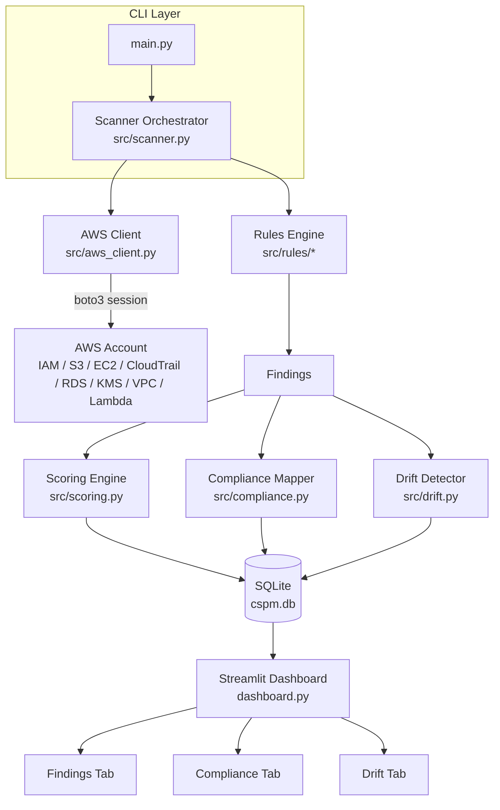

<div align="center">

# ☁️ AWS CSPM Tool

**Cloud Security Posture Management for AWS**

A lightweight CSPM tool that discovers AWS resources, checks them against the **CIS AWS Foundations Benchmark**, maps findings to compliance frameworks (NIST / PCI / ISO), scores your security posture, and tracks changes over time — with an interactive dashboard.

`Python` · `boto3` · `Streamlit` · `SQLite` · `pytest`

[](https://opensource.org/licenses/MIT)
[](https://www.python.org/downloads/)
[](https://aws.amazon.com/)
[]()
[](https://streamlit.io/)

</div>

---

## 📌 Overview

AWS CSPM Tool continuously evaluates an AWS account for security misconfigurations. It:

- **Discovers** resources across IAM, S3, EC2, CloudTrail, RDS, KMS, VPC, and Lambda
- **Checks** them against 14+ security rules mapped to **CIS AWS Foundations Benchmark**
- **Scores** your overall security posture (0–100, letter-grade A–F)
- **Maps** every finding to NIST 800-53, PCI DSS v4.0, and ISO/IEC 27001:2022
- **Tracks** drift between scans (new failures, resolved issues, new/removed resources)
- **Visualizes** everything in an interactive Streamlit dashboard

> **Designed for security engineers, auditors, and students** who want to understand cloud security posture — not just run a black-box scanner.

---

## 🏗️ Architecture



**Data flow:** CLI triggers a scan → boto3 session discovers resources → rules engine evaluates each resource → findings are scored, mapped to compliance frameworks, and stored in SQLite → the dashboard visualizes results and compares scans over time.

---

## ✨ Features

| Feature | Description |
|---------|-------------|
| 🔍 **Resource Discovery** | Scans 8 AWS services (IAM, S3, EC2, CloudTrail, RDS, KMS, VPC, Lambda) |
| 🛡️ **14+ Security Checks** | Mapped to CIS AWS Foundations Benchmark controls |
| 🎯 **Posture Scoring** | 0–100 score with A–F letter grades, severity-weighted |
| 🏛️ **Multi-Framework** | NIST 800-53 Rev. 5, PCI DSS v4.0, ISO/IEC 27001:2022 mapping |
| 📈 **Drift Detection** | Tracks NEW_FAIL, RESOLVED, NEW_RESOURCE, REMOVED_RESOURCE between scans |
| 🗄️ **SQLite Persistence** | Full scan history for posture trending over time |
| 📊 **Streamlit Dashboard** | Interactive filtering, exportable reports, compliance view |
| 🧪 **Testable** | Designed to run without real AWS credentials (mocked boto3) |

---

## 🔒 Security Checks

| Rule ID | AWS Service | Control | Check |
|---------|-------------|---------|-------|
| IAM-001 | IAM | CIS 1.5 | MFA enabled on root account |
| IAM-002 | IAM | CIS 1.16 | IAM policies attached to users (vs groups/roles) |
| S3-001 | S3 | CIS 2.1.5 | S3 bucket allows public read access |
| S3-002 | S3 | CIS 2.1.2 | S3 bucket allows public write access |
| EC2-001 | EC2 | CIS 4.1 | Security groups with unrestricted inbound SSH (22) |
| EC2-002 | EC2 | CIS 4.1 | Security groups with unrestricted inbound RDP (3389) |
| CT-001 | CloudTrail | CIS 3.1 | CloudTrail enabled in the region |
| CT-002 | CloudTrail | CIS 3.2 | CloudTrail log file validation enabled |
| CT-003 | CloudTrail | CIS 3.3 | CloudTrail integrated with CloudWatch Logs |
| RDS-001 | RDS | CIS 2.1.1 | RDS instance publicly accessible |
| RDS-002 | RDS | CIS 2.1.1 | RDS instance encryption at rest disabled |
| KMS-001 | KMS | CIS 2.1.1 | KMS key rotation not enabled |
| VPC-001 | VPC | CIS 4.4 | Default VPC security groups unrestricted (0.0.0.0/0) |
| LMB-001 | Lambda | — | Lambda function with overly permissive IAM role |
| LMB-002 | Lambda | — | Lambda function with public event source mapping |

*Each finding includes a remediation recommendation.*

---

## 🚀 Quick Start

### Prerequisites
- Python 3.10+
- AWS account (or local emulator like [FLoC](https://github.com/localstack/localstack) for testing)
- IAM identity with **read-only** permissions (`SecurityAudit` managed policy covers everything)

### Installation

```bash
# 1. Clone & install
git clone https://github.com/adwaidhdinesh/aws-cspm-tool.git
cd aws-cspm-tool
python -m venv .venv && source .venv/bin/activate
pip install -r requirements.txt

# 2. Configure AWS credentials (any standard boto3 method)
aws configure
# or: export AWS_ACCESS_KEY_ID / AWS_SECRET_ACCESS_KEY / AWS_SESSION_TOKEN
```

### Run a Scan

```bash
python main.py
```

Prints a summary, saves findings to `cspm.db`, and writes `latest_findings.json`.

### Launch the Dashboard

```bash
streamlit run dashboard.py
```

---

## 🧪 Testing

The project is designed to be testable **without real AWS credentials** — boto3 calls are mocked so you can run the full test suite locally with no AWS access.

```bash
pip install pytest pytest-mock
pytest
```

**Test coverage includes:**
- ✅ Rule modules (each service's checks)
- ✅ Scoring engine (severity weights, grade calculation)
- ✅ Compliance mapping (CIS → NIST/PCI/ISO crosswalk)
- ✅ Drift detection (change classification)
- ✅ Database layer (SQLite persistence)
- ✅ CLI flow (end-to-end)

---

## 🗺️ Roadmap

- [ ] PDF/HTML compliance report generator
- [ ] Scheduled scanning (cron / Lambda) for continuous monitoring
- [ ] Slack / email alerting on new Critical findings
- [ ] Multi-account support (cross-account role assumption)
- [ ] AI-assisted security analysis of findings
- [ ] More checks: VPC flow logs, GuardDuty, AWS Config

---

## 📄 License

MIT License — see [LICENSE](LICENSE).

---

## 🙌 Contributing

Found a bug? Want a new security check? Open an issue or PR.

See [CONTRIBUTING.md](CONTRIBUTING.md) for guidelines.

---

<div align="center">
  <sub>Built for learning and real-world use — feedback and PRs welcome!</sub>
</div>